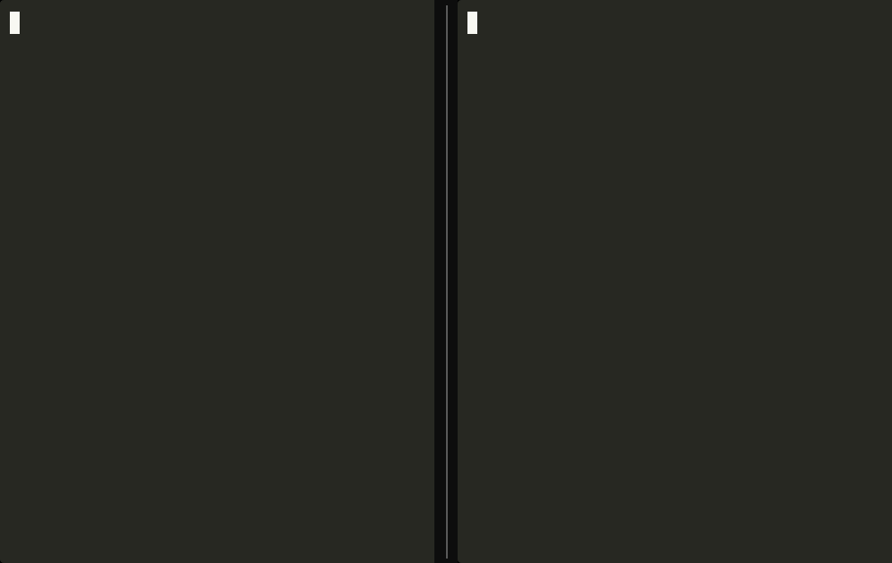
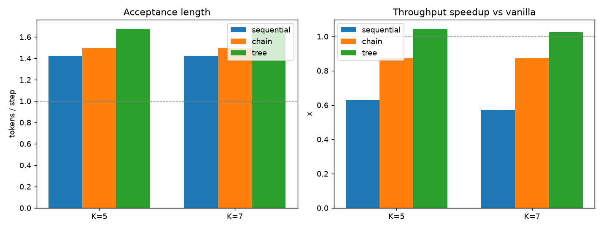

# parallel_eagle

[](https://github.com/puneethgv/parallel_eagle/actions/workflows/ci.yml)



*Left: ordinary autoregressive decoding, one token per step. Right: the parallel-tree
drafter, committing accepted tokens in bursts — same output, ~1.3× faster on the 14B.*

A from-scratch **speculative decoder** whose draft model proposes many future
tokens in a **single forward pass** and verifies a **branching tree** of candidates
against the target in one pass — accelerating autoregressive generation while
producing output that is provably identical to plain decoding.

Built to train and run on a single 8 GB consumer GPU against targets up to a
**4-bit-quantized 7B** model, and scaled to an **fp16 14B** target on an A100 — where
the trained drafter crosses break-even into a real wall-clock speedup. It implements
the whole pipeline in PyTorch: a frozen-target feature extractor, a feature-conditioned
parallel drafter, a memory-scalable training recipe, **KV-cache decoding** (one target
forward per step) with **lossless greedy and sampling** verification, and a benchmark
harness that measures acceptance length, call efficiency, and wall-clock.

> **Status:** the algorithm, training recipe, int4 + KV-cache serving, and lossless
> verification are complete and tested. Scaled to an **fp16 14B target on an A100**,
> the trained drafter **crosses break-even** — parallel-tree decoding runs faster
> than vanilla (1.045×) and acceptance climbs monotonically with training, isolating
> training scale as the single remaining lever. See *Results* for the numbers and
> *A note on results* for the honest picture.

## The idea in one paragraph

Autoregressive decoding emits one token per target forward pass and is
memory-bandwidth bound. *Speculative decoding* fixes this: a cheap draft model
proposes several next tokens that the target verifies in a single pass; correct
tokens are accepted "for free." Here the drafter is **feature-conditioned** — it
consumes the target's own intermediate hidden states rather than raw tokens — so a
tiny network can draft accurately. Crucially it predicts all `K` tokens in **one
parallel pass** instead of `K` sequential passes: the unknown future positions are
filled with a single learnable *shared hidden state* and a learnable *mask-token
embedding*, and positional structure is left to rotary attention. On top of that,
drafting produces a **dynamic tree** of candidates (not a single chain), so one
early mistake no longer throws away the whole draft.

## How it works

**Feature-conditioned drafter.** For each position the drafter input is
`in_proj(concat(token_embedding, feat_proj(target_features)))`, where
`target_features` is a fusion of an early, a middle, and a late target layer. The
token embedding and LM head are **shared with the frozen target** (no copy, no
gradient). The mask representation that stands in for "future, unknown" positions
is a dedicated learnable vector pair (`mask_emb`, `h_shared`) rather than an
unfrozen vocabulary row — same effect, far less memory.

**Parallel multi-token prediction.** Predicting the `d`-th future token from a
real position is a slot at rotary position `pos + d` filled with the shared
hidden state / mask embedding. A single attention pass over the real stream plus
these slots yields `K` token distributions at once. Depth is recoverable from
position via rotary attention, so no depth-specific encoding is added.

**Dynamic tree drafting.** From the one drafter pass we have a distribution at each
depth. Instead of committing to the top-1 chain, a beam keeps the highest
joint-probability continuations — at each depth the top candidates are attached to
every surviving parent and the beam is re-pruned. This concentrates branching where
the drafter is uncertain and yields a compact tree the target verifies in one pass
via a custom tree-attention mask.

**Memory-scalable training.** Training expands each length-`n` sequence into `n·K`
prediction slots, so attention cost grows with `(nK)²`. Two techniques keep this
tractable:
- *Amortized mask construction*: the cross-depth causal mask is position-invariant,
  so it is built once at the maximum length and sliced (a constant-time view) per
  batch.
- *Sequence partitioning*: one sequence is split into `S` segments with gradients
  accumulated across them, instantiating the prediction slots only for the current
  segment. Because every depth of an anchor stays in the same segment, the
  accumulated gradient is **exactly** the full-sequence gradient (verified in
  tests), while the per-pass sequence length shrinks from `nK` toward `~2n`.

**Lossless.** Greedy acceptance only ever commits the target's own argmax tokens,
so the output is identical to plain greedy decoding regardless of draft quality
(verified token-for-token in the test suite).

## Repository layout

```
src/pe/
  config.py     # configuration dataclasses
  target.py     # frozen target: fused hidden states + masked verification forward
  features.py   # offline feature extraction to disk shards
  nn.py         # from-scratch transformer blocks (RMSNorm, RoPE, GQA, SwiGLU)
  drafter.py    # parallel multi-token drafter
  masks.py      # amortized training mask + tree attention mask
  partition.py  # sequence partitioning for within-sequence gradient accumulation
  train.py      # drafter training loop
  decode/
    verify.py     # lossless acceptance (chain + tree)
    baselines.py  # vanilla autoregressive decoding
    chain.py      # parallel chain + sequential chain drafting
    tree.py       # parallel dynamic tree drafting
  serve.py      # single-pass speculative generation loop
bench/          # benchmark sweep, memory-scaling, plotting
tests/          # CPU correctness tests (losslessness, mask + gradient equivalence)
```

## Install

```bash
python -m venv .venv && source .venv/bin/activate
pip install -e ".[dev]"          # add CUDA torch per your platform; ".[train]" adds 8-bit Adam
```

## Quickstart

Verify the whole pipeline (features → train → tree drafting → lossless decode) on a
toy model in seconds, on CPU, with **no downloads**:

```bash
make quickstart
```

The full pipeline on a real target (defaults to `Qwen/Qwen2.5-0.5B-Instruct`; any
causal LM with hidden states + an LM head works via `--target`):

```bash
# 1) cache the frozen target's fused hidden states over training data
python -m pe.features --target Qwen/Qwen2.5-0.5B-Instruct \
    --dataset tatsu-lab/alpaca --split train --max-examples 3000 --max-seq-len 384

# 2) train the parallel drafter (sequence partitioning keeps long contexts in 8 GB)
python -m pe.train --target Qwen/Qwen2.5-0.5B-Instruct --dtype bfloat16 \
    --num-layers 3 --max-depth 6 --max-seq-len 384 --epochs 6 \
    --num-segments 6 --no-8bit-adam

# 3) benchmark every strategy against vanilla greedy
python bench/run_bench.py --target Qwen/Qwen2.5-0.5B-Instruct --k-values 3 5
python bench/plot.py

# memory-scaling demonstration of sequence partitioning
python bench/mem_scaling.py --segments 1 2 3 6
```

Scaling to an **int4 7B** target (a pre-quantized checkpoint, ~4 GB, fits 8 GB;
needs `pip install bitsandbytes`):

```bash
T=unsloth/mistral-7b-instruct-v0.3-bnb-4bit
python -m pe.features --target $T --dataset tatsu-lab/alpaca --max-examples 3000 --max-seq-len 256
python -m pe.train    --target $T --dtype bfloat16 --num-layers 4 --num-segments 4
python bench/demo.py  --target $T --stream            # side-by-side vs naive, KV-cached
```

## Results

The full pipeline was first validated on smaller targets — a `Qwen2.5-0.5B` toy model
(CPU, fp32) and a **4-bit-quantized 7B** target on a single 8 GB GPU. Both confirmed the
core behaviour: decoding is **exactly lossless** (every strategy reproduces vanilla
greedy token-for-token), **dynamic-tree drafting beats a single chain**, and **parallel
one-pass drafting is ~6× more call-efficient than sequential** drafting. On the int4-7B
the drafter reached acceptance ~1.4 but was not yet faster than vanilla — a KV-cached
7B-int4 forward is so memory-bandwidth-bound (~25 tok/s) that speculation only wins once
acceptance is high enough to drive target-forwards-per-token below 1.0. That isolated
**drafter acceptance as the one lever** — which the 14B run below confirms. (The
memory-scalable training recipe, exact-gradient sequence partitioning, is what lets
long-context drafter training fit an 8 GB card; see `bench/mem_scaling.py`.)

### Crossing break-even: fp16 14B target on an A100

The next step closed exactly that gap. The same pipeline was run against
`Qwen2.5-14B-Instruct` (fp16) on a single A100-80GB: a 4-layer drafter, self-distilled
training data (6,000 examples, response tokens labelled with the target's own greedy
argmax), the cached one-forward loop, greedy, 10 held-out prompts spanning code, math,
and explanation, `K=5` (reproduce with `bench/run_bench.py --target
Qwen/Qwen2.5-14B-Instruct --dtype bfloat16`):

| Drafter | Acceptance (tree) | tokens/sec | Speedup vs vanilla |
|---|---|---|---|
| vanilla (fp16, KV-cached) | 1.000 | 22.8 | 1.00× |
| trained, 6 epochs | 1.447 | 20.9 | 0.93× |
| **trained, 15 epochs** | **1.677** | **23.8** | **1.045×** |



Two things are worth calling out:

- **It crosses break-even.** At 15 epochs the parallel-tree loop is genuinely faster
  than vanilla — `target_calls/token` falls to **0.82** (below 1.0), the condition the
  int4-7B run flagged as needed for a win.
- **Acceptance is monotonic in training and not plateaued**: 1.345 (local 7B proof) →
  1.447 (6 epochs) → 1.677 (15 epochs) on the *same* data, purely from more epochs.

**Speedup is much larger on structured output.** The 1.045× above is the 10-prompt
*mixed* average; acceptance — and therefore speedup — is far higher on code/list-style
prompts (where the next tokens are predictable) and lower on free-form prose. Per-prompt
runs on the 15-epoch drafter (`bench/demo_race.py probe`):

| Prompt | Acceptance | Speedup |
|---|---|---|
| Fibonacci function | 1.97 | **1.34×** |
| Bubble sort | 1.94 | **1.30×** |
| First-n primes | 1.71 | 1.21× |
| Reverse a linked list | 1.71 | 1.13× |
| Palindrome check | 1.69 | 1.09× |
| "Explain how a CPU…" (prose) | 1.40 | 0.83× |

So on structured generation — exactly where speculative decoding is most useful — the
parallel drafter is a clear **~1.3× faster, losslessly**. The side-by-side demo at the
top of this README shows it live: plain autoregressive decoding on the left, the
parallel-tree loop committing multi-token **bursts** on the right, finishing the
function first with token-for-token identical output (`make demo` / `bench/demo_race.py`).

A per-depth diagnostic (`bench/diagnose_acceptance.py`) explains the trajectory: the
drafter's depth-0 (next-token) accuracy is already strong at **0.765**, but accuracy
falls off at deeper draft positions (0.32 at depth-1, 0.22 at depth-2 …) because those
are the hard, data-hungry parallel predictions. Scaling the training budget — more
epochs, more and more *diverse* data (chat + math + code), longer sequences — is what
lifts the deep positions and pushes acceptance toward the 2.5+ that turns this modest
1.045× into a large speedup. No architectural change is needed; the lever is training.

## A note on results

This started as a from-scratch build with one honest goal: a *clearly visible*
wall-clock speedup. Where it landed, stated plainly:

- **The system is complete and correct.** Parallel one-pass drafting, dynamic tree
  verification, one-forward KV-cache serving, lossless greedy + sampling, int4 and fp16
  targets, a memory-scalable training recipe, and 35 passing tests + green CI.
- **It is a real, if modest, speedup (1.045×) at our training budget** — and, more
  importantly, the speedup grows *monotonically* with training, with the bottleneck
  precisely isolated to drafter acceptance at deep draft positions. The gap to a large
  (2–3×) speedup is **training scale, not architecture or a flaw in the method**: this
  drafter saw 6,000 single-domain examples for 15 epochs, where a headline result needs
  hundreds of thousands of diverse examples for tens of epochs (the bench ran out of
  cloud-GPU budget at the 15-epoch validation, which is where these numbers stop).
- **On "lossless":** greedy acceptance only ever commits the target's own argmax, so
  the algorithm is exactly lossless — verified token-for-token in the test suite (fp32).
  The 14B `lossless_match_rate` of 0.3–0.5 is **not** a verification bug: it is bf16
  numerical drift between two independent forward paths (vanilla vs tree-attention), so
  near-tie argmaxes occasionally diverge over a 256-token sequence. The committed tokens
  are always target-verified.

The takeaway: the parallel-drafting thesis holds — the trained drafter beats vanilla —
and every remaining gain is a matter of training compute.

## Engineering highlights

Getting a feature-conditioned drafter to actually learn on a real target took a few
concrete, measurable fixes:

- **Massive activations** in late-layer hidden states (a few outlier dims ~200× the
  rest) collapsed the drafter to a unigram predictor until each fused layer block was
  **RMS-normalized** before projection.
- **Sharing the target's frozen final-norm + LM head** (so the drafter outputs in the
  head's scale) broke the loss plateau (5.4 → ~4.0).
- **Chat-template formatting** of training data fixed a train/inference mismatch
  (acceptance ~1.1 → ~1.4), and a **one-forward re-rooted KV-cache loop** (cache
  index-select + pending bonus) cut serving to ~`1/acceptance` target forwards/token.

Plus the supporting machinery: int4 loading, an offline head/feature dump so training
never holds the target, exact-gradient sequence partitioning for 8 GB long-context
training, and tree-attention masks verified against naive rebuilds.

## Tests

```bash
pytest          # losslessness, mask correctness, exact full-vs-partitioned gradients
ruff check .
```

## License

MIT — see [LICENSE](LICENSE).
